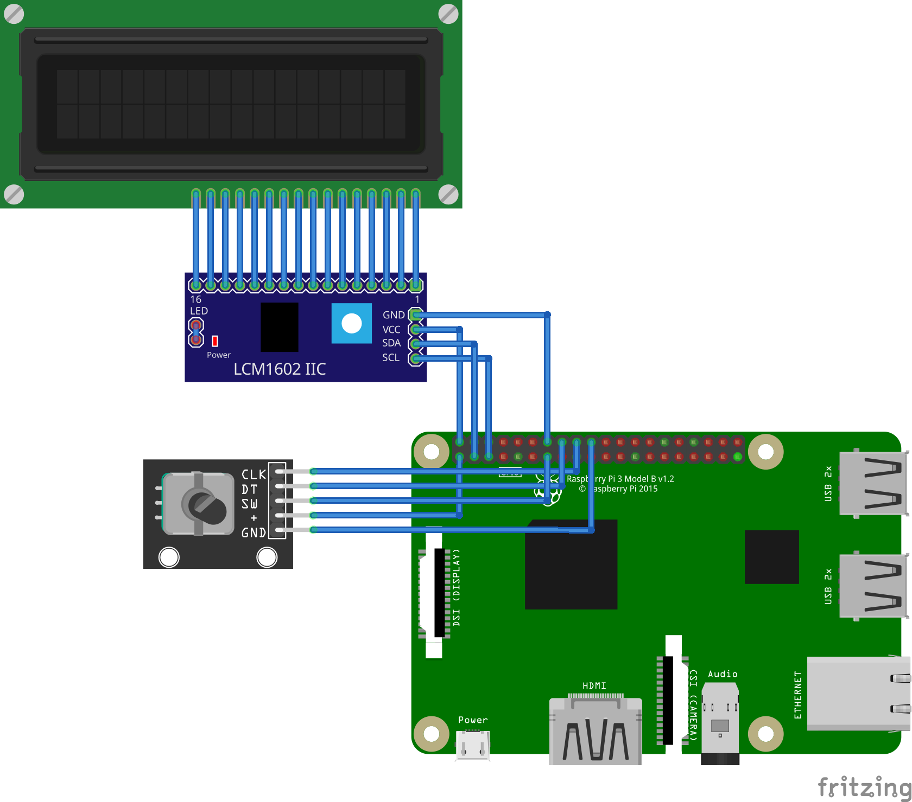

## Raspberry Pi Time Machine

I was inspired to write this app by the great [video](https://www.youtube.com/watch?v=0OB1g8CUdbA) by [The Science Elf](https://www.youtube.com/c/TheScienceElf) - this is not my idea.

Raspberry Pi Time Machine allows you to experience how the web has changed over time. It redirects all the internet traffic coming from the Pi's ethernet port through [WaybackProxy](https://github.com/richardg867/WaybackProxy). You can configure everything both from the website hosted by the Pi and the internal 16x2 LCD.


### Required parts

- Raspberry Pi (Tested only on the 3B)
- I2C 16x2 LCD
- A simple rotary encoder


### Setting up the Pi

- Connect all the peripherals as shown in the diagram below (or change `raspi-configurator/config.py`):


<table>
<tr><th>LCD Connections</th><th>Encoder Connections</th></tr>
<tr>
<td>

| LCD Pin |       RPI Pin        |
|---------|----------------------|
|   GND   |     Pin 14 (GND)     |
|   VCC   |     Pin 2 (+5V)      |
|   SDA   | Pin 3 (GPIO 2 / SDA) |
|   SCL   | Pin 5 (GPIO 3 / SCL) |

</td>
<td>

| Encoder Pin |       RPI Pin        |
|-------------|----------------------|
|     GND     |    Pin 20 (GND)      |
|      +      |    Pin 1 (+3.3V)     |
|     SW      |    Pin 13 (GPIO 27)  |
|     DT      |    Pin 16 (GPIO 23)  |
|     CLK     |    Pin 18 (GPIO 24)  |

</td>
</tr>
</table>

- Download and image Raspberry Pi OS Lite onto an SD card (Make sure SSH is enabled and you know the credentials for the default account, and that you **DO NOT** enable pre-configured WiFi)
- Connect the Pi to your network using the ethernet port
- Enable I2C in `raspi-config`
- In Raspberry Pi OS run:
```
sudo apt update
sudo apt install git -y
git clone https://github.com/asivery/raspi-time-machine
cd raspi-time-machine
```
- Install and run i2cdetect to check on what address and bus your screen is running, if your display is **not** running on address 0x27 bus 1, adjust `raspi-configurator/config.py` before installation (Optional, but recommended)
- Once you are sure the peripherals are all connected correctly, and the config in `raspi-configurator/config.py` is valid, run:
```
cd install
sudo bash install.sh
sudo python3 /opt/raspi-configurator/main.py --base-only
```
- After that, make sure the display and encoder both work, and that you can go through menus and set up WiFi. This is the most important step, as once you restart, you won't be able to connect to the pi via the ethernet port anymore. Once you make sure the WiFi works, you can restart the pi from the 'System' menu.
- You're all done!

### Setting up the client

The only configuration that needs to take place on the client computer is setting up static IP for the LAN.

The correct configuration is:
|   Name            |   Value       |
|-------------------|---------------|
| IP                | 192.168.2.2   |
| Subnet Mask       | 255.255.255.0 |
| Default Gateway   | 192.168.2.1   |
| DNS               | 1.1.1.1       |

You can change the time machine's configuration at http://time.machi.ne (or http://192.168.2.1:8088 If the WiFi isn't set up) from the client device, or at http://[WiFi IP]:8088 from any other device on the time machine's WiFi network.


### Troubleshooting

#### Cannot connect to WiFi after `sudo bash install.sh`

Sometimes there can occur a conflict between dhcpcd and NetworkManager as both programs are trying to start wpa_supplicant

Solution - stop dhcpcd, (try to) kill wpa_supplicant, restart NetworkManager and retry
```
sudo systemctl stop dhcpcd
sudo killall -9 wpa_supplicant
sudo systemctl restart NetworkManager
sudo python3 /opt/raspi-configurator/main.py --base-only
```

### Credits:

- [WaybackProxy](https://github.com/richardg867/WaybackProxy) by richardg867
- [I2C LCD library](https://gist.github.com/DenisFromHR/cc863375a6e19dce359d) by DenisFromHR
- [rpi-rotary-encoder-python](https://github.com/nstansby/rpi-rotary-encoder-python) by nstansby

#### The parts diagram:

- [Fritzing](https://fritzing.org)
- [Rotary encoder part](https://forum.fritzing.org/t/ky-040-rotary-encoder-breakout-board-part/11073)
- [LCM1602 module](https://fritzing.org/projects/arduino-i2c-lcd-display)
